# GCP Infrastructure Provisioning Automation
## ServiceNow → GitHub → Terraform/OpenTofu → GCP

**Status:** Proposed  
**Audience:** IBX / Platform Engineering / DevOps / Security / ServiceNow / Application Teams  
**Objective:** Automate the complete GCP infrastructure request lifecycle while preserving enterprise SDLC, security, approval, auditability, and operational controls.

---

## 1. Executive Summary

The proposed solution establishes a self-service, event-driven infrastructure provisioning platform.

Developers submit a structured request through ServiceNow. The request is acknowledged immediately and processed asynchronously. A provisioning workflow validates the request, resolves the appropriate GCP project, environment, Terraform module, repository, policy and approval requirements, and creates a controlled GitHub change.

GitHub remains the source of truth for infrastructure configuration. The project infrastructure repository references versioned Terraform/OpenTofu modules from the central module repository. Reusable GitHub Actions execute formatting, validation, tests, security scans, policy checks and Terraform/OpenTofu plan.

Only after the required approvals are satisfied is the exact approved plan applied. Post-provision validation confirms that the GCP resource is actually usable before ServiceNow is marked complete.

### Target principle

> **ServiceNow owns the request and governance; the provisioning platform owns orchestration; GitHub owns the change; the central Terraform module repository owns reusable infrastructure implementation; Terraform/OpenTofu owns desired state; GCP owns the resulting infrastructure.**

---

# 2. Goals

The platform should provide:

- Self-service GCP infrastructure requests
- Immediate acknowledgement to requesters
- Asynchronous processing
- Parallel processing of independent requests
- Controlled serialization for requests sharing Terraform state
- Automated GitHub change creation
- Centralized reusable CI/CD
- Security and vulnerability checks
- Policy-as-code enforcement
- Terraform/OpenTofu testing
- Terraform/OpenTofu plan generation
- Risk-based approval
- Exact approved-plan application
- Post-provision validation
- ServiceNow status synchronization
- End-to-end auditability
- Idempotent request processing
- Centralized Terraform modules
- Support for approximately 100 project repositories × 3 environments
- Future agentic assistance without bypassing deterministic controls

---

# 3. Non-Goals

The automation should not:

- Generate arbitrary Terraform code from user input
- Allow ServiceNow users to execute Terraform directly
- Modify the central Terraform module repository for individual provisioning requests
- Bypass GitHub pull-request controls
- Bypass security/policy gates
- Allow an AI agent to approve its own infrastructure change
- Store long-lived GCP service-account keys in GitHub
- Automatically upgrade Terraform module versions during normal provisioning
- Automatically destroy resources when post-provision validation fails

---

# 4. High-Level Architecture

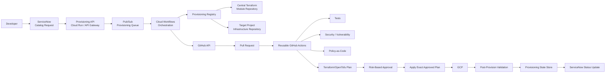

---

# 5. End-to-End Request Flow

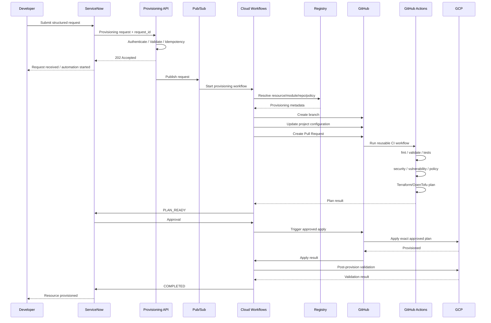

---

# 6. ServiceNow Request Contract

ServiceNow should provide a **structured request**, not Terraform code.

Example:

```json
{
  "request_id": "REQ0012345",
  "request_type": "gcp_resource_provision",
  "requester": {
    "id": "developer123"
  },
  "application": "credit-analytics",
  "project_id": "ibx-project-042",
  "environment": "prod",
  "resource": {
    "type": "gcs_bucket",
    "name": "customer-data",
    "region": "us-central1",
    "storage_class": "STANDARD",
    "retention_days": 365
  },
  "business": {
    "owner": "team-a",
    "cost_center": "12345"
  }
}
```

## Required characteristics

The contract should be:

- Versioned
- Schema validated
- Idempotent
- Traceable
- Independent of Terraform implementation
- Restricted to approved resource types
- Validated against organizational policies

### Important

The request expresses:

> **What the developer needs**

It should not express:

> **How Terraform should implement it**

---

# 7. Request Acknowledgement

The initial ServiceNow/API interaction should be fast.

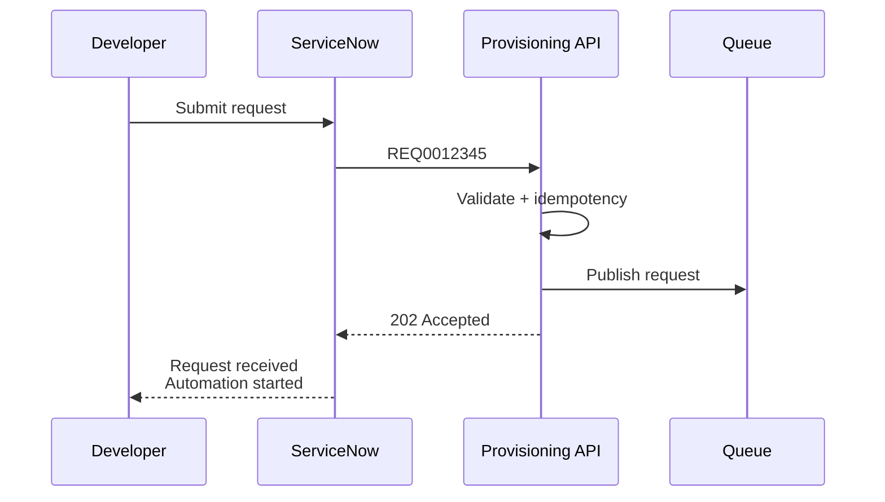

The developer should immediately see:

```text
Request: REQ0012345
Status: ACKNOWLEDGED
Message: Provisioning automation started
```

The developer should not wait synchronously for Terraform.

---

# 8. Why an Asynchronous Queue

Multiple developers may submit requests simultaneously.

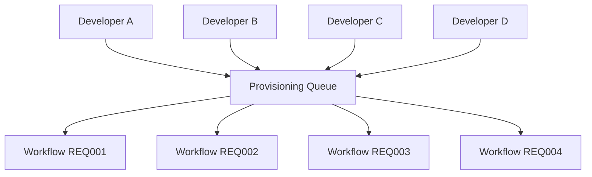

The queue provides:

- Asynchronous processing
- Burst handling
- Retry
- Dead-letter handling
- Independent request processing
- Controlled concurrency
- Future event consumers

---

# 9. Provisioning Registry

The Provisioning Registry is a critical component.

It maps:

```text
Business Request
      ↓
Resource Type
      ↓
Approved Terraform Module
      ↓
Module Version
      ↓
Target Repository
      ↓
Environment
      ↓
Security Policy
      ↓
Approval Policy
      ↓
Post-Provision Test
```

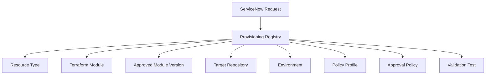

Example:

```yaml
gcs_bucket:
  module: gcs
  module_version: "3.2.0"
  repository_pattern: "{project}-infra"
  config_path: "environments/{environment}"
  policy_profile: "standard-storage"
  approval_policy: "production-owner"
  post_provision_test: "gcs-validation"
```

This avoids hard-coding 100 repositories and resource mappings into Workflows.

---

# 10. Repository Strategy

Assumption:

- ~100 GCP project infrastructure repositories
- Each repository manages 3 environments
- A central Terraform module repository exists

Recommended structure:

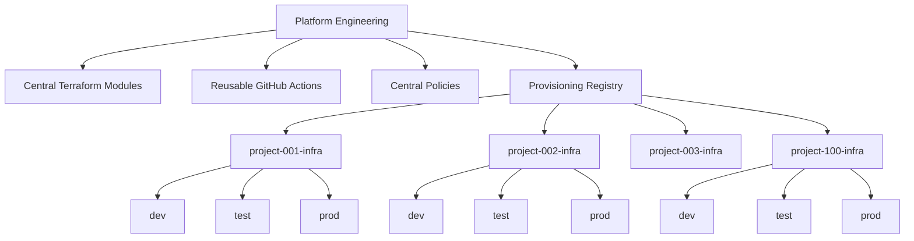

### Project repository responsibility

The project repository owns:

> **What resources this project/environment requires.**

The central module repository owns:

> **How the approved resource is implemented.**

---

# 11. Central Terraform Module Repository

The central module repository is effectively an **infrastructure platform API**.

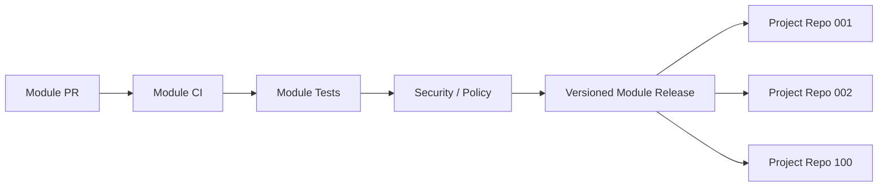

Example:

```hcl
module "gcs" {
  source  = "central-registry/gcs/google"
  version = "3.2.0"

  project_id     = var.project_id
  name           = var.bucket_name
  location       = var.region
  retention_days = var.retention_days
}
```

### Important rule

A ServiceNow provisioning request should **never modify the central module implementation**.

A module change follows its own module SDLC and release process.

---

# 12. Configuration Change

For a provisioning request, automation creates a branch and modifies the target project's configuration.

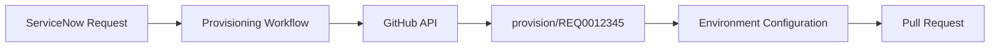

Example configuration:

```hcl
bucket_name    = "customer-data"
region         = "us-central1"
retention_days = 365
```

The automation should not generate arbitrary Terraform implementation.

---

# 13. CI/CD Quality Gates

Every generated PR should go through the same standardized pipeline.


Existing organization-standard tooling should be reused wherever possible.

Avoid creating different CI implementations across 100 repositories.

---

# 14. Security Gates

Security should be enforced before approval.

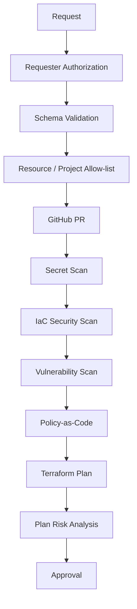

Examples of policy checks:

```text
Public storage?
Overprivileged IAM?
0.0.0.0/0 firewall?
Unapproved region?
Missing encryption?
Missing required labels?
Missing logging?
Invalid project?
Resource exceeds quota?
Cost exceeds threshold?
```

---

# 15. Policy-as-Code

Security rules should be centralized.

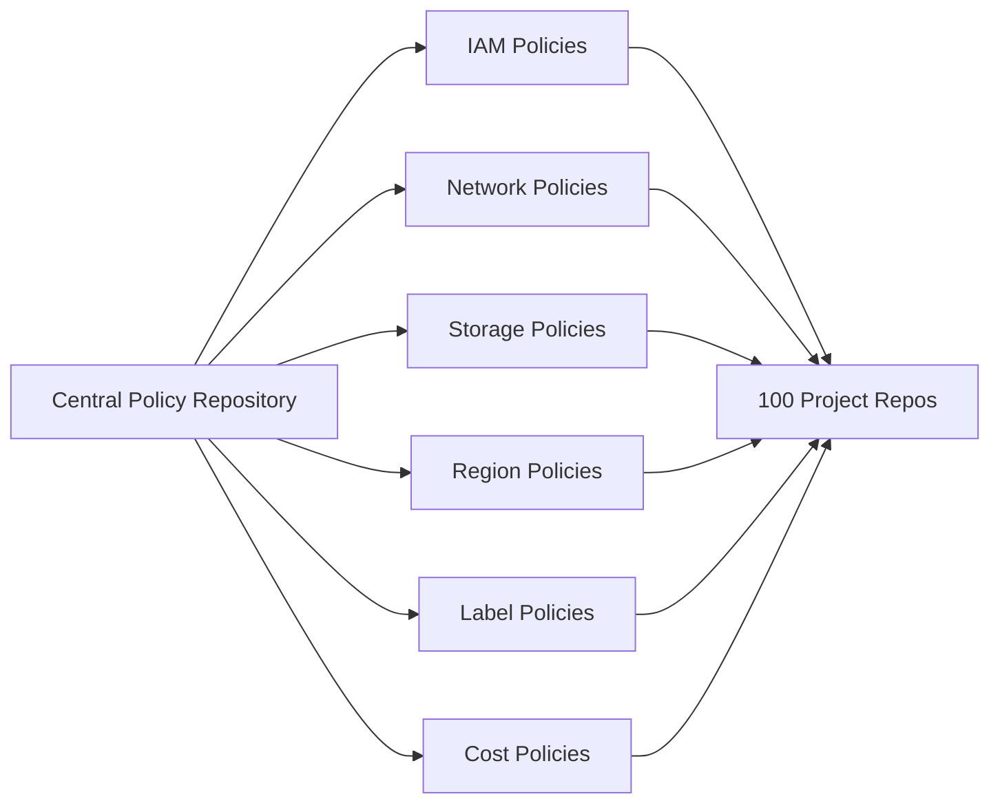

This prevents policy drift across repositories.

---

# 16. Approval Model

Approval should be **risk-based**, not identical for every request.

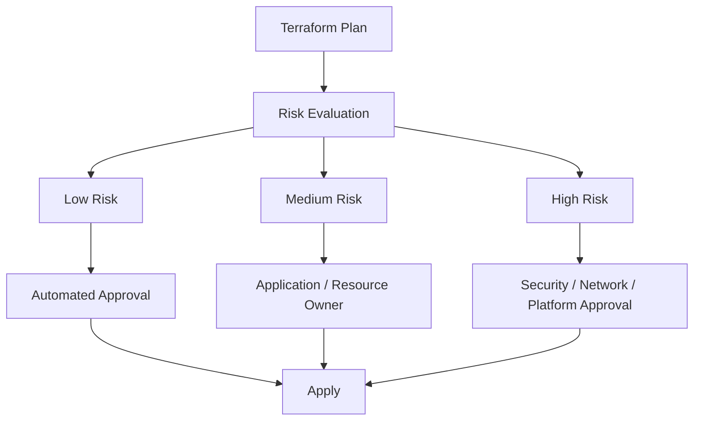

Example:

| Change | Approval |
|---|---|
| Dev GCS | Automated |
| Dev Pub/Sub | Automated |
| Test resource | Policy dependent |
| Production resource | Application owner |
| IAM | Security |
| VPC / firewall | Network |
| KMS | Security |
| Production deletion | Mandatory elevated approval |
| High-cost resource | FinOps / designated approver |

---

# 17. ServiceNow + GitHub Approval

Both systems can have complementary responsibilities.

### ServiceNow

Business/change governance:

- Requester authorization
- Business justification
- Application ownership
- Change classification
- Business approval
- Audit record

### GitHub

Technical governance:

- Pull request review
- CODEOWNERS
- CI checks
- Security checks
- Policy checks
- Terraform plan

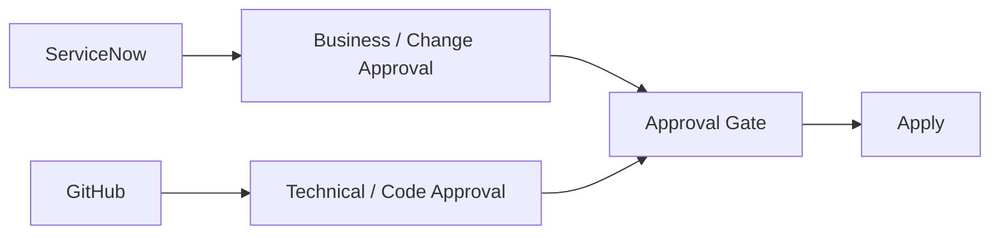

---

# 18. Terraform/OpenTofu Plan

The plan should be generated before approval.

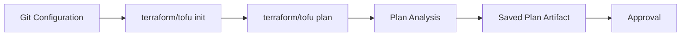

The approver should be able to see:

```text
REQ0012345

Project: ibx-project-042
Environment: PROD

Terraform Plan

1 to add
0 to change
0 to destroy

Security: PASS
Policy: PASS
Cost: PASS

Resource:
google_storage_bucket.customer_data
```

---

# 19. Exact-Plan Apply

Do not regenerate the plan after approval.

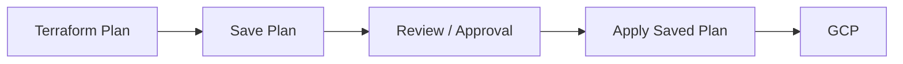

Principle:

> **Approve what was planned; apply what was approved.**

---

# 20. Terraform/OpenTofu Tests

Tests should exist at multiple levels.

### Module level

The central module repository validates reusable module behavior.

```text
GCS Module
 ├── naming
 ├── encryption
 ├── IAM
 ├── retention
 └── region
```

### Project configuration level

The project repository validates the specific configuration.

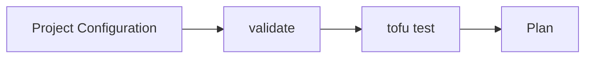

### Post-provision level

Validate the actual GCP resource.

---

# 21. Post-Provision Validation

Terraform success does not automatically mean the resource is usable.

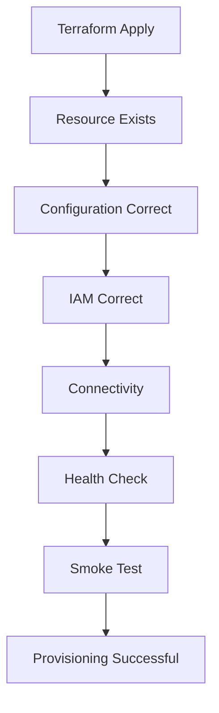

Examples:

### GCS

- Bucket exists
- Correct project
- Correct region
- Encryption enabled
- IAM correct
- Public access disabled
- Retention correct

### BigQuery

- Dataset exists
- Correct location
- IAM correct
- Required labels
- Schema/data validation where applicable

### Cloud SQL

- Instance exists
- Private networking
- Encryption
- Backup configuration
- Connectivity

---

# 22. Concurrency Model

The system should support parallel requests while protecting shared Terraform state.

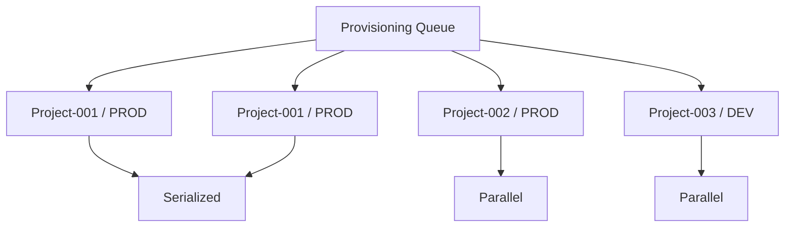

### Rule

> **Parallelize across independent project/environment/state boundaries; serialize requests that target the same state boundary.**

Recommended concurrency key:

```text
project + environment + terraform state
```

This protects against:

- Git configuration conflicts
- Concurrent PR races
- Terraform state conflicts
- Inconsistent desired state

---

# 23. Idempotency

Every request should carry a unique ServiceNow request ID.

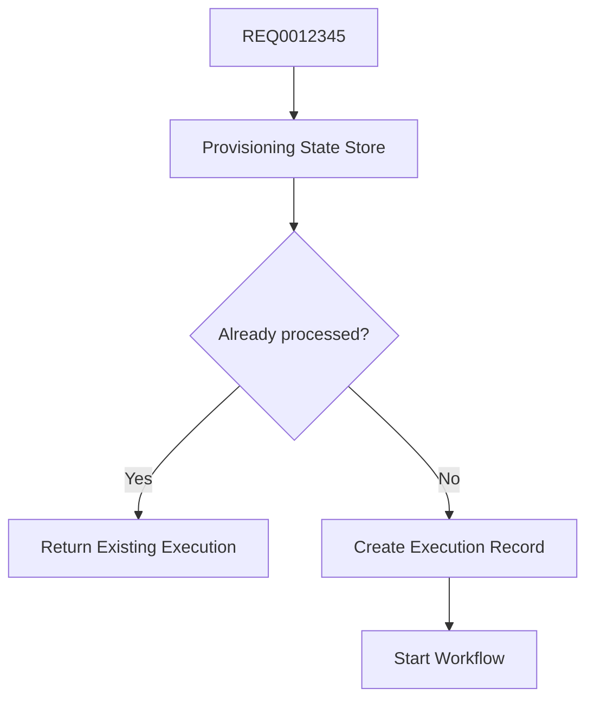

If ServiceNow retries the same request, the platform should not create duplicate infrastructure changes.

---

# 24. Provisioning State Store

Maintain transaction state independently from ServiceNow and GitHub.

Example:

```json
{
  "request_id": "REQ0012345",
  "status": "PLAN_READY",
  "project_id": "ibx-project-042",
  "environment": "prod",
  "resource_type": "gcs_bucket",
  "repository": "project-042-infra",
  "branch": "provision/REQ0012345",
  "pull_request": 482,
  "workflow_execution": "execution-abc123",
  "approval_status": "PENDING",
  "created_at": "2026-09-04T00:00:00Z"
}
```

Possible implementations:

- Firestore
- Cloud SQL
- Existing enterprise-approved datastore

---

# 25. GCP Authentication

GitHub Actions should use short-lived federation.

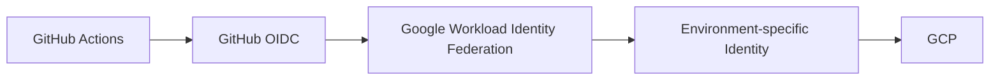

Avoid long-lived service-account JSON keys.

Use least-privilege identities.

Example:

```text
terraform-plan
terraform-dev-apply
terraform-test-apply
terraform-prod-apply
```

Production permissions should be tightly restricted.

---

# 26. Failure and Retry

```mermaid
flowchart TD
    EXEC[Execution] --> SUCCESS[Success]
    EXEC --> RETRYABLE{Retryable?}

    RETRYABLE -->|Yes| RETRY[Retry with Backoff]
    RETRYABLE -->|No| FAIL[Failed]

    RETRY --> EXEC

    FAIL --> DLQ[Dead Letter / Manual Remediation]
    DLQ --> SN[ServiceNow Action Required]
```

### Retryable

- Temporary GitHub API failure
- Transient GCP API error
- Temporary quota/API issue
- Event delivery failure

### Non-retryable

- Invalid request
- Policy violation
- Unauthorized requester
- Unsupported resource
- Terraform validation failure

---

# 27. ServiceNow Lifecycle

ServiceNow should expose meaningful status rather than simply "In Progress."

Recommended states:

```text
RECEIVED
ACKNOWLEDGED
VALIDATING
QUEUED
CHANGE_CREATED
CI_RUNNING
PLAN_READY
AWAITING_APPROVAL
APPLYING
VALIDATING_RESOURCE
COMPLETED
FAILED
REJECTED
```

```mermaid
stateDiagram-v2
    [*] --> RECEIVED
    RECEIVED --> ACKNOWLEDGED
    ACKNOWLEDGED --> VALIDATING
    VALIDATING --> REJECTED
    VALIDATING --> QUEUED
    QUEUED --> CHANGE_CREATED
    CHANGE_CREATED --> CI_RUNNING
    CI_RUNNING --> PLAN_READY
    CI_RUNNING --> FAILED
    PLAN_READY --> AWAITING_APPROVAL
    AWAITING_APPROVAL --> REJECTED
    AWAITING_APPROVAL --> APPLYING
    APPLYING --> VALIDATING_RESOURCE
    APPLYING --> FAILED
    VALIDATING_RESOURCE --> COMPLETED
    VALIDATING_RESOURCE --> FAILED
    COMPLETED --> [*]
    REJECTED --> [*]
    FAILED --> [*]
```

---

# 28. End-to-End Traceability

The ServiceNow request ID should propagate through the entire transaction.

```mermaid
flowchart LR
    REQ[REQ0012345]
    REQ --> SN[ServiceNow]
    REQ --> API[Provisioning API]
    REQ --> PUB[Pub/Sub]
    REQ --> WF[Workflow]
    REQ --> BR[Git Branch]
    REQ --> PR[GitHub PR]
    REQ --> ACTION[GitHub Actions]
    REQ --> PLAN[Terraform Plan]
    REQ --> GCP[GCP Audit]
```

Searchable correlation fields should include:

```text
request_id
application
project_id
environment
repository
workflow_execution_id
pull_request_id
terraform_run_id
actor
timestamp
status
```

---

# 29. Agentic Automation

Agentic capabilities can improve the experience without replacing deterministic controls.

```mermaid
flowchart TD
    REQ[ServiceNow Request] --> AGENT[Provisioning Assistant]

    AGENT --> INTERPRET[Interpret Request]
    AGENT --> COMPLETE[Detect Missing Information]
    AGENT --> RECOMMEND[Recommend Configuration]
    AGENT --> EXPLAIN[Explain Policy / Plan]

    INTERPRET --> POLICY[Deterministic Policy Engine]
    COMPLETE --> POLICY
    RECOMMEND --> POLICY

    POLICY --> WF[Provisioning Workflow]
    WF --> GH[GitHub]
    GH --> PLAN[Terraform Plan]

    PLAN --> AGENT2[Plan Analysis Agent]
    AGENT2 --> SUMMARY[Human-readable Impact Summary]
    AGENT2 --> POLICY2[Deterministic Approval / Policy]
```

## Good agentic use cases

### 1. Request understanding

Developer:

> "Create a production storage location for Credit Analytics."

Agent detects missing:

- Data classification
- Retention
- Region

and requests the missing information.

### 2. Configuration recommendation

Agent can recommend compliant defaults based on approved organizational standards.

### 3. Plan explanation

Agent can turn Terraform output into:

> Creates one production GCS bucket, applies required encryption and labels, grants approved application access, and introduces no destructive changes.

### 4. Failure diagnosis

Agent can analyze CI failures and suggest remediation.

### 5. Policy explanation

Agent can explain why a request was rejected.

---

# 30. Agentic Guardrails

Agents should not be allowed to:

- Bypass security policy
- Bypass required approval
- Grant arbitrary IAM
- Execute arbitrary Terraform
- Modify central modules autonomously
- Approve their own change
- Disable CI checks
- Override production protection

Principle:

> **Agent recommends → deterministic policy decides → authorized human approves where required → controlled automation executes.**

---

# 31. Automation vs Human Decision Boundary

```mermaid
flowchart TD
    REQUEST[Request] --> AUTOMATION[Automation]

    AUTOMATION --> VALIDATION[Validation]
    VALIDATION --> SECURITY[Security]
    SECURITY --> POLICY[Policy]
    POLICY --> PLAN[Plan]

    PLAN --> RISK{Risk}

    RISK -->|Low| AUTO[Automated Approval]
    RISK -->|Medium| OWNER[Owner Approval]
    RISK -->|High| HUMAN[Elevated Approval]

    AUTO --> APPLY[Controlled Apply]
    OWNER --> APPLY
    HUMAN --> APPLY

    APPLY --> VALIDATE[Post-Provision Validation]
```

The objective is not "remove humans."

The objective is:

> **Remove unnecessary human work while preserving human decision points where risk requires them.**

---

# 32. Recommended Target Operating Model

```mermaid
flowchart TD
    SN[ServiceNow<br/>Request + Governance]

    SN --> PROV[Provisioning Platform]

    PROV --> REG[Registry]
    PROV --> QUEUE[Queue]
    PROV --> WF[Workflow]

    REG --> MODULE[Central Modules]
    WF --> REPO[Project Repositories]

    REPO --> CI[Central Reusable CI/CD]

    CI --> POLICY[Security + Policy]
    CI --> PLAN[Terraform/OpenTofu Plan]

    PLAN --> APPROVAL[Risk-Based Approval]

    APPROVAL --> APPLY[Apply]

    APPLY --> GCP[GCP]

    GCP --> VALIDATION[Validation]

    VALIDATION --> STATE[State Store]
    STATE --> SN2[ServiceNow]
```

---

# 33. Suggested Technology Responsibilities

| Component | Responsibility |
|---|---|
| ServiceNow | Request catalog, business context, approvals, user status |
| API Gateway / Cloud Run | API boundary, authentication, schema validation, acknowledgement, idempotency |
| Pub/Sub | Asynchronous request queue, retry, decoupling |
| Cloud Workflows | Orchestration and state machine |
| Provisioning Registry | Resource → module → repo → environment → policy mapping |
| Central Terraform Module Repo | Reusable infrastructure implementation |
| Project Infra Repo | Environment-specific desired configuration |
| GitHub | Source control, PR and technical governance |
| Reusable GitHub Actions | Standard CI/CD execution |
| Policy Engine | Deterministic security/governance |
| Terraform/OpenTofu | Infrastructure plan/apply |
| GCP | Infrastructure target |
| State Store | Provisioning transaction state |
| Agent | Request assistance, recommendation, explanation, diagnosis |

---

# 34. Recommended MVP

Do not implement every resource and every agentic capability initially.

## Phase 1 — Deterministic provisioning

Start with 2–3 representative resource types:

- GCS
- BigQuery
- Pub/Sub

Prove:

```mermaid
flowchart LR
    SN[ServiceNow] --> API[API]
    API --> Q[Queue]
    Q --> WF[Workflow]
    WF --> GH[GitHub PR]
    GH --> CI[CI]
    CI --> PLAN[Plan]
    PLAN --> APPROVAL[Approval]
    APPROVAL --> APPLY[Apply]
    APPLY --> GCP[GCP]
    GCP --> VALIDATE[Validation]
    VALIDATE --> SN
```

## Phase 2 — Scale

Add:

- More GCP resource types
- More project repositories
- Concurrency controls
- Dead-letter handling
- Cost controls
- More policies
- More post-provision tests
- Centralized observability

## Phase 3 — Agentic

Add:

- Request assistant
- Missing-information detection
- Configuration recommendations
- Plan summarization
- Policy explanation
- Failure diagnosis
- Remediation suggestions

---

# 35. Architecture Principles

### Principle 1 — Git remains the source of truth

Infrastructure changes are represented as Git changes.

### Principle 2 — ServiceNow is the front door

Users should not need to understand Terraform implementation.

### Principle 3 — Modules are reusable platform APIs

Project repositories consume versioned central modules.

### Principle 4 — Automation is asynchronous

Users receive acknowledgement immediately.

### Principle 5 — Parallelism is controlled

Independent state boundaries can execute in parallel; shared state boundaries are serialized.

### Principle 6 — Security is preventative

Security and policy gates happen before approval and apply.

### Principle 7 — Approval is risk-based

Low-risk changes should be automated; high-risk changes receive appropriate human approval.

### Principle 8 — Apply exactly what was approved

The saved Terraform/OpenTofu plan is the deployment artifact.

### Principle 9 — Post-provision validation is mandatory

Terraform success is not the same as resource readiness.

### Principle 10 — Agents augment, not bypass, controls

AI/agents improve request quality and operational efficiency without becoming an uncontrolled execution authority.

---

# 36. Proposed Architecture Decision

## Recommended

**ServiceNow → Provisioning API → Pub/Sub → Cloud Workflows → Provisioning Registry → GitHub PR → Reusable CI → Security/Policy → Terraform/OpenTofu Plan → Risk-Based Approval → Exact-Plan Apply → GCP → Post-Provision Validation → ServiceNow**

This approach provides:

- High automation
- Self-service infrastructure
- Fast acknowledgement
- Asynchronous request processing
- Controlled parallel execution
- Strong SDLC
- Central security
- Central policy
- Versioned Terraform modules
- Standardized CI/CD
- Risk-based approvals
- End-to-end auditability
- Idempotency
- Post-provision validation
- A clear path toward agentic infrastructure operations

---

# 37. Key Proposal Statement

> **The proposed platform turns ServiceNow infrastructure requests into controlled Git-based infrastructure changes. Developers request the desired GCP capability rather than writing Terraform. The platform resolves the approved module, repository, environment and policy, creates a GitHub change, executes standardized security/testing/plan gates, routes approval according to risk, applies the exact approved plan, validates the resulting GCP resource, and continuously updates ServiceNow.**

> **The architecture maximizes automation while keeping deterministic security, policy, approval and Terraform controls authoritative.**

---

# 38. Key Questions for IBX Technical Design Review

Before implementation, confirm:

1. What ServiceNow catalog/request types are required?
2. What is the approved ServiceNow → GCP integration mechanism?
3. Is API Gateway/Cloud Run already an approved integration pattern?
4. Is Pub/Sub approved for provisioning events?
5. What existing GitHub workflows/checks can be reused?
6. What existing Terraform/OpenTofu tests already exist?
7. Which security/vulnerability/IaC scanning tools are mandatory?
8. What policy-as-code framework is already standardized?
9. What constitutes low/medium/high infrastructure risk?
10. Which changes require ServiceNow approval?
11. Which changes require GitHub CODEOWNERS approval?
12. What is the concurrency boundary for Terraform state?
13. How are the 100 repositories mapped to projects/environments?
14. How are Terraform state files separated?
15. What is the approved GCP identity/WIF model?
16. What post-provision tests exist per resource type?
17. Where should provisioning transaction state be stored?
18. What ServiceNow statuses and callbacks are required?
19. What are retry and dead-letter requirements?
20. Which agentic use cases are acceptable for the first release?

---

## Final Architecture Principle

```mermaid
flowchart LR
    USER[Developer Intent]
    USER --> SN[ServiceNow<br/>Governance]

    SN --> AUTOMATION[Provisioning Automation]

    AUTOMATION --> GIT[GitHub<br/>Change Control]

    GIT --> SDLC[Security + Tests + Policy + Plan]

    SDLC --> APPROVAL[Risk-Based Approval]

    APPROVAL --> TF[Terraform/OpenTofu]

    TF --> GCP[GCP]

    GCP --> VERIFY[Validation]

    VERIFY --> SN

    AGENT[Agentic Assistance] -. assists .-> SN
    AGENT -. assists .-> AUTOMATION
    AGENT -. explains .-> SDLC

    POLICY[Deterministic Controls] -. governs .-> AUTOMATION
    POLICY -. governs .-> SDLC
    POLICY -. governs .-> TF
```

**North-star:**  
**Developer intent → governed automation → Git change → validated infrastructure → verified outcome.**
