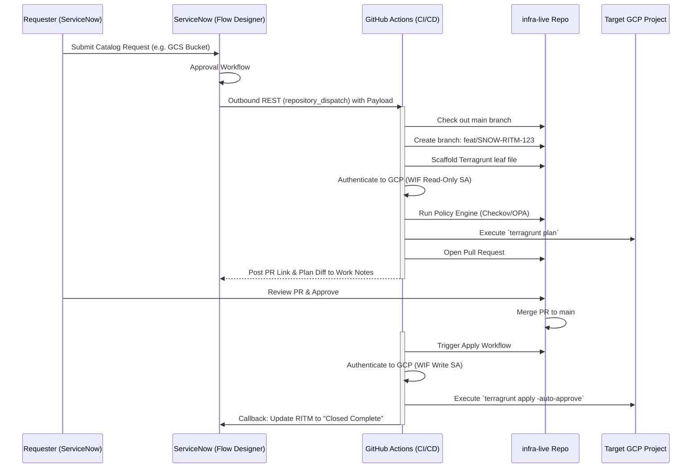
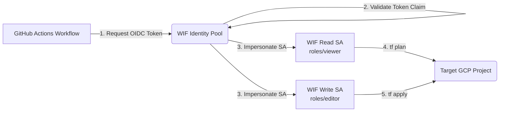

# End-to-End GCP Platform Engineering & Automated Provisioning Architecture

**Document Version:** 1.0 (Final Architecture Blueprint)
**Target Organization:** Independence Blue Cross (IBX)
**Scope:** Multi-Project, Multi-Service, Multi-Module Automation
**Alignment:** IBX Managed Services SOW (2026–2029)[cite: 1, 6]

---

## 1. Executive Summary & Core Pain Points

### Core Pain Points
* **Operational Admin Bottleneck:** Cloud Admins spend 60–80% of their bandwidth on manual, repetitive Terraform updates, delaying critical P1 incident responses and strategic platform enhancements.
* **Configuration Drift & Human Error:** Manual service deployments lead to missing security controls (e.g., DevOps missing VPC Access Connectors on Cloud Run instances or exposing public IP addresses on VMs).
* **Pipeline Collisions & Lock Contention:** Monolithic Terraform state files and shared execution branches cause frequent state lock failures and Git merge conflicts when multiple teams request resources simultaneously[cite: 3].
* **Long-Lived Credentials:** Legacy automation relies on static Service Account keys stored in CI/CD secrets, presenting continuous security and audit risks[cite: 4, 5].

---

## 2. Strategic Objectives (What We Are Solving)

* **Zero-Touch Provisioning:** Provide a self-service workflow via ServiceNow that automatically provisions GCP infrastructure without manual Cloud Admin intervention[cite: 5].
* **Multi-Tenant State Isolation:** Architect a dynamic, multi-project monorepo where state files are isolated per GCP project, preventing cross-environment blast radiuses[cite: 3].
* **Shift-Left Security & Governance:** Enforce Policy-as-Code guardrails (OPA/Checkov) inside the PR stage to block non-compliant resources before GCP API execution[cite: 4].
* **Immutable & Scalable Architecture:** Standardize infrastructure modules through Git-tagged semantic releases (`infra-modules`) consumed by environment-specific leaf declarations (`infra-live`)[cite: 3, 4].

---

## 3. Current Proposed Strategy vs. Next-Gen Architecture

| Architectural Component | Current Proposed Strategy | Next-Gen Enterprise Solution (Recommended) | Architectural Advantage |
| :--- | :--- | :--- | :--- |
| **Event Orchestration** | ServiceNow → GCP Pub/Sub → Cloud Run Python Orchestrator → GitHub | ServiceNow Flow Designer → GitHub `repository_dispatch` (OIDC App Token)[cite: 5] | **Zero Middleware Maintenance:** Eliminates custom Cloud Run container maintenance; uses push-based native API integration[cite: 5]. |
| **Git & Branch Strategy** | Direct commits/pushes to `dev` branch with `--rebase` retry loops | Feature Branches (`feat/SNOW-123`) → Automated PRs → Trunk-based `main`[cite: 4] | **Collision Resistance:** Eliminates Git push race conditions and forces PR code reviews + pre-apply checks[cite: 3, 4]. |
| **Execution Engine** | Split across GitHub and GCP Cloud Build | Native GitHub Actions powered by Workload Identity Federation (WIF)[cite: 4, 5] | **Single Plane of Glass:** Consolidates logs, execution traces, and PR plan comments in one platform without long-lived keys[cite: 4, 5]. |
| **IaC State Management** | Centralized Terraform state / tfvars append loops[cite: 5] | Terragrunt Monorepo with dynamic per-project backend derivation (`tfstate-<project_id>`)[cite: 3] | **Blast Radius Containment:** Sub-second plans, isolated state locks, and zero cross-project state dependencies[cite: 3]. |
| **Security Enforcement** | Manual review or post-apply audit | CI Pipeline Policy-as-Code (Checkov / OPA / TFLint)[cite: 4] | **Preventative Governance:** Blocks unencrypted storage, public IPs, or missing VPC connectors at PR time[cite: 4]. |

---

## 4. End-to-End Architecture & Sequence Flow



---

## 5. Repository Structure & Developer Guide

To decouple module development from environment deployment, the architecture spans two repositories: `infra-modules` (reusable components) and `infra-live` (state and deployment declarations).

### 5.1 Repository 1: `infra-modules` (Module Catalog)

This repository holds versioned, single-purpose Terraform modules. Releases are managed automatically via `release-please`.

```text
infra-modules/
├── .github/
│   └── workflows/
│       └── release-please.yml    # Auto-cuts semantic versions (e.g., v1.2.0)[cite: 4]
├── gcs-bucket/
│   ├── main.tf
│   ├── variables.tf
│   ├── outputs.tf
│   └── versions.tf
├── compute-vm/
├── vertex-workbench/
├── cloud-sql/
├── secret-manager/               #[cite: 5]
├── load-balancer/
└── cloud-run-scanner/

```

**Example: `gcs-bucket/main.tf` (Enforcing Guardrails)**

```hcl
resource "google_storage_bucket" "this" {
  name                        = var.bucket_name
  location                    = var.location
  project                     = var.project_id

  # Guardrails enforced at module level
  uniform_bucket_level_access = true
  public_access_prevention    = "enforced"

  dynamic "encryption" {
    for_each = var.kms_key_name != null ? [1] : []
    content {
      default_kms_key_name = var.kms_key_name
    }
  }

  versioning {
    enabled = var.versioning_enabled
  }
}

```

---

### 5.2 Repository 2: `infra-live` (Terragrunt Monorepo)

This repository acts as the GitOps source of truth for all GCP deployments. It uses a 4-layer inheritance model (`Root` → `Environment` → `Region` → `Leaf`).

```text
infra-live/
├── root.hcl                 # Layer 0: Global backend & provider generation[cite: 3]
├── _envcommon/              # Layer 3: Base module wiring[cite: 3]
│   ├── gcs-bucket.hcl
│   ├── compute-vm.hcl
│   ├── vertex-workbench.hcl
│   ├── cloud-sql.hcl
│   ├── secret-manager.hcl   #[cite: 5]
│   └── load-balancer.hcl
├── dev/                     # Layer 1: Environment Scope[cite: 3]
│   ├── env.hcl
│   ├── ibx-analytics-dev/   # GCP Service Project A
│   │   └── us-central1/     # Layer 2: Region Scope[cite: 3]
│   │       ├── region.hcl
│   │       └── raw-landing-zone/  # Target Leaf Path
│   │           └── terragrunt.hcl # Generated by ServiceNow[cite: 3]
│   └── ibx-app-dev/         # GCP Service Project B
└── prod/
    ├── env.hcl
    └── ibx-analytics-prod/

```

#### Layer 0: `root.hcl` (Dynamic State Backend)

Generates the backend configuration dynamically, isolating state per GCP project to avoid lock contention.

```hcl
locals {
  env_vars   = read_terragrunt_config(find_in_parent_folders("env.hcl"))
  project_id = local.env_vars.locals.project_id
}

remote_state {
  backend = "gcs"
  generate = {
    path      = "backend.tf"
    if_exists = "overwrite_terragrunt"
  }
  config = {
    # Dynamically maps state bucket to project: tfstate-ibx-analytics-dev
    bucket   = "tfstate-${local.project_id}"
    # Derives state path from directory tree
    prefix   = "${path_relative_to_include()}"
    project  = local.project_id
    location = "us"
  }
}

```

#### Layer 1: `dev/env.hcl` (Environment Variables)

```hcl
locals {
  env        = "dev"
  project_id = "ibx-analytics-dev"
  deletion_protection = false # Overridden to true in prod/env.hcl
}

```

#### Layer 3 Template: `_envcommon/gcs-bucket.hcl`

Wires the standard module and provides default inputs.

```hcl
locals {
  base_source = "git::[https://github.com/ibx/infra-modules.git//gcs-bucket](https://github.com/ibx/infra-modules.git//gcs-bucket)"
}

terraform {
  # Consumers pin the specific module version in their leaf file
  source = "${local.base_source}?ref=${local.module_version}"
}

inputs = {
  versioning_enabled = true
}

```

#### Layer 4 Leaf: `dev/ibx-analytics-dev/us-central1/raw-landing-zone/terragrunt.hcl`

**This is the ~15-line file generated automatically by the ServiceNow webhook**.

```hcl
include "root" {
  path = find_in_parent_folders("root.hcl")
}

include "envcommon" {
  path   = "${dirname(find_in_parent_folders("root.hcl"))}/_envcommon/gcs-bucket.hcl"
  expose = true
}

locals {
  # Pin to a validated immutable module release
  module_version = "v1.2.0"
  region_vars    = read_terragrunt_config(find_in_parent_folders("region.hcl"))
}

inputs = {
  # Project ID and region are inherited automatically from parent folders
  bucket_name = "ibx-raw-landing-zone-dev"
  location    = local.region_vars.locals.region

  # Specific configurations requested via ServiceNow
  labels = {
    requested_by = "data-eng-team"
    sn_ticket    = "RITM0098412"
  }
}

```

---

## 6. Security & CI/CD Pipelines

### Workload Identity Federation (WIF) Architecture

No static service account keys are stored in GitHub[cite: 4, 5]. All authentication relies on OIDC short-lived tokens[cite: 4, 5].



### GitHub Actions Workflow (Plan Pipeline Snippet)

```yaml
name: Terragrunt Plan
on:
  pull_request:
    branches: [main]

jobs:
  plan:
    runs-on: ubuntu-latest
    permissions:
      contents: read
      id-token: write # Required for WIF OIDC
      pull-requests: write
    steps:
      - uses: actions/checkout@v4

      - name: Authenticate to GCP (Read Only)
        uses: google-github-actions/auth@v2
        with:
          workload_identity_provider: 'projects/123/locations/global/workloadIdentityPools/github/providers/github'
          service_account: 'tf-plan-sa@admin-project.iam.gserviceaccount.com'

      - name: Run Policy Checks (Checkov)
        uses: bridgecrewio/checkov-action@master
        with:
          directory: infra-live/
          framework: terraform

      - name: Terragrunt Plan
        run: |
          # Use path filtering to only plan the changed directory
          CHANGED_DIR=$(git diff --name-only origin/main HEAD | grep 'terragrunt.hcl' | xargs dirname)
          cd $CHANGED_DIR
          terragrunt plan -out tfplan

```

---

## 7. Statement of Work (SOW) Compliance Verification

The architecture strictly adheres to all operational boundaries and Year 1 contractual caps outlined in the IBX Managed Services Agreement[cite: 1, 6]:

* **Zero Custom UI Portal (Section 5h Boundary):** Uses IBX's existing ServiceNow catalog for inputs and GitHub Actions for pipeline execution, avoiding out-of-scope custom UI portal development[cite: 1, 5, 6].
* **No Unapproved Proprietary Tooling (Section 5g Boundary):** Built entirely using open-source industry standards (Terragrunt, OpenTofu, Checkov, GitHub Actions).

* **IaC Module Limit (Section 7a.ii):** The 7 core services consume 7 of the 15 allowable Year 1 new IaC modules[cite: 1, 6].
* **Automated Workflow Limit (Section 7a.i):** The ServiceNow push-dispatch pipeline consumes 1 of the 25 allowable Year 1 automated workflows[cite: 1, 5, 6].
* **Policy Guardrails Limit (Section 7b.iii):** Enforces 7 of the 15 allowable Year 1 policy-as-code guardrails[cite: 1, 4, 6].
* **Staffing & Delivery Model (Sections 8 & 12):** Delivered by the 13 FTE Year 1 Platform Engineering team across 2-week Agile sprint cycles[cite: 1, 6].


